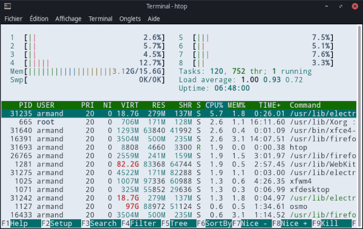
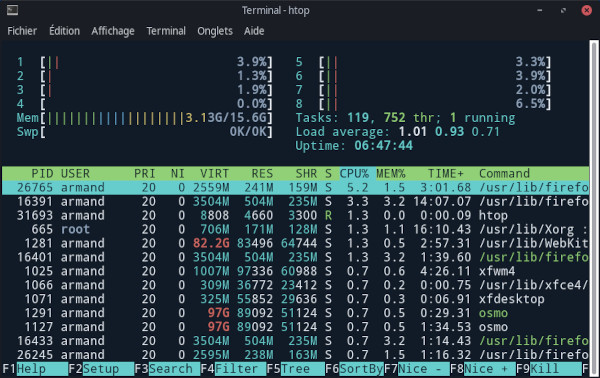

    

# Coldark

 

An optimized theme for web development that comes with two versions: light & dark.

## Presentation

[Coldark](https://github.com/ArmandPhilippot/coldark/) is a gray-blue theme. The colors used respect the Web Content Accessibility Guidelines (WCAG) in order to provide sufficient reading comfort.

## Colors

Coldark consists of three color palettes. The first is common to both versions. The other two each apply to a version.

Coldark uses 16 colors for each theme. However, the Coldark version for the XFCE4 terminal only uses 11 colors.

Color adjustment was also necessary on the light theme: `#0b121b` was not suitable, so it was replaced by `#ccd6e4`.

|                | Light Theme |                                                          | Dark Theme |                                                          |
| -------------- | ----------- | :------------------------------------------------------: | :--------: | :------------------------------------------------------: |
| **Usage code** | **Hex**     |                       **Preview**                        |  **Hex**   |                       **Preview**                        |
| `coldark00`    | `#E3E9F2`   |  | `#111B27`  |  |
| `coldark02`    | `#ccd6e4`   |  | `#304259`  |  |
| `coldark03`    | `#304259`   |  | `#ccd6e4`  |  |
| `coldark04`    | `#ccd6e4`   |  | `#d8e0eb`  |  |
| `coldark05`    | `#111B27`   |  | `#E3E9F2`  |  |
| `coldark08`    | `#007474`   |  | `#5dc2c2`  |  |
| `coldark09`    | `#7d6600`   |  | `#cdb74a`  |  |
| `coldark10`    | `#005c99`   |  | `#6ab3e4`  |  |
| `coldark11`    | `#237800`   |  | `#82c366`  |  |
| `coldark12`    | `#b800b8`   |  | `#ea89ea`  |  |
| `coldark15`    | `#bf0100`   |  | `#f57a73`  |  |

- **`coldark00`: Default background**  
  Also used as black.
- **`coldark02`: Selection background**
- **`coldark03`: Selection foreground**  
  Also used as dark gray.
- **`coldark04`: Light Gray**
- **`coldark05`: Default foreground**  
  Also used for bold and as white.
- **`coldark08`: Cyan**  
  Also used as light cyan.
- **`coldark09`: Yellow**  
  Also used as light yellow.
- **`coldark10`: Blue**  
  Also used as tab activity color and as light blue.
- **`coldark11`: Green**  
  Also used as light green.
- **`coldark12`: Magenta**  
  Also used as light magenta.
- **`coldark15`: Red**  
  Also used as light red.

## Screenshots

|                             Light Theme                              |                             Dark Theme                             |
| :------------------------------------------------------------------: | :----------------------------------------------------------------: |
|  |  |

## Install

If the folder `~/.local/share/xfce4/terminal/colorschemes/` does not exist, create it. Then place the color schemes in the folder.

## Activation

1. Open your XFCE4 terminal
2. Open the "Edit" menu and select "Preferences"
3. Select the "Colors" tab.
4. You will see a "Load Presets" drop-down menu. In the list, you should now see "Coldark - Cold" and "Coldark - Dark". Select the one you want.

## License

This project is open source and available under the [MIT License](https://github.com/ArmandPhilippot/coldark-xfce4-terminal/blob/master/LICENSE).
