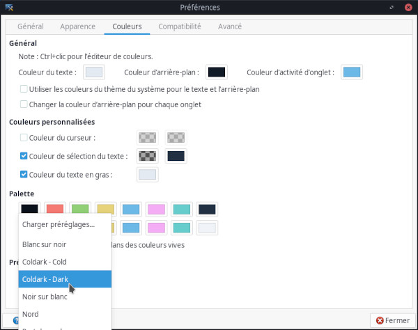

    

# Coldark

 

An optimized theme for web development that comes with two versions: light & dark.

## Presentation

[Coldark](https://github.com/ArmandPhilippot/coldark/) is a gray-blue theme. The colors used respect the Web Content Accessibility Guidelines (WCAG) in order to provide sufficient reading comfort.

## Colors

Coldark consists of three color palettes. The first is common to both versions. The other two each apply to a version.

Coldark uses 16 colors for each theme. However, the Coldark version for the XFCE4 terminal only uses 11 colors.

|  | Light Theme |  | Dark Theme |  | Both |
| :-: | --- | :-: | --- | :-: | --- |
| **Denomination** | **Hex Code** | **Preview** | **Hex Code** | **Preview** | **Description** |
| `coldark00` | `#e3eaf2` | ![#e3eaf2][#e3eaf2] | `#111b27` | ![#111b27][#111b27] | Default background & Black |
| `coldark02` | `#8da1b9` | ![#8da1b9][#8da1b9] | `#3c526d` | ![#3c526d][#3c526d] | Selection background |
| `coldark03` | `#3c526d` | ![#3c526d][#3c526d] | `#8da1b9` | ![#8da1b9][#8da1b9] | Dark gray |
| `coldark05` | `#111b27` | ![#111b27][#111b27] | `#e3eaf2` | ![#e3eaf2][#e3eaf2] | Default foreground & Light gray |
| `coldark06` | `#0b121b` | ![#0b121b][#0b121b] | `#f0f4f8` | ![#f0f4f8][#f0f4f8] | White |
| `coldark08` | `#006d6d` | ![#006d6d][#006d6d] | `#66cccc` | ![#66cccc][#66cccc] | Cyan |
| `coldark09` | `#755f00` | ![#755f00][#755f00] | `#e6d37a` | ![#e6d37a][#e6d37a] | Yellow |
| `coldark10` | `#005a8e` | ![#005a8e][#005a8e] | `#6cb8e6` | ![#6cb8e6][#6cb8e6] | Blue / Tab activity color |
| `coldark11` | `#116b00` | ![#116b00][#116b00] | `#91d076` | ![#91d076][#91d076] | Green |
| `coldark12` | `#af00af` | ![#af00af][#af00af] | `#f4adf4` | ![#f4adf4][#f4adf4] | Magenta |
| `coldark15` | `#c22f2e` | ![#c22f2e][#c22f2e] | `#cd6660` | ![#cd6660][#cd6660] | Red |

## Screenshots

| Light Theme | Dark Theme |
| :-: | :-: |
|  |  |

## Install

If the folder `~/.local/share/xfce4/terminal/colorschemes/` does not exist, create it. Then place the color schemes in the folder.

## Activation

1. Open your XFCE4 terminal
2. Open the "Edit" menu and select "Preferences"
3. Select the "Colors" tab.
4. You will see a "Load Presets" drop-down menu. In the list, you should now see "Coldark - Cold" and "Coldark - Dark". Select the one you want.

## License

This project is open source and available under the [MIT License](https://github.com/ArmandPhilippot/coldark-xfce4-terminal/blob/master/LICENSE).

<!-- REFERENCES -->

<!-- UI Colors -->

[#f0f4f8]: https://placehold.it/20/f0f4f8/000000?text=+
[#e3eaf2]: https://placehold.it/20/e3eaf2/000000?text=+
[#d0dae7]: https://placehold.it/20/d0dae7/000000?text=+
[#8da1b9]: https://placehold.it/20/8da1b9/000000?text=+
[#3c526d]: https://placehold.it/20/3c526d/000000?text=+
[#213043]: https://placehold.it/20/213043/000000?text=+
[#111b27]: https://placehold.it/20/111b27/000000?text=+
[#0b121b]: https://placehold.it/20/0b121b/000000?text=+

<!-- Syntax - Light Theme Colors -->

[#c22f2e]: https://placehold.it/20/c22f2e/000000?text=+
[#116b00]: https://placehold.it/20/116b00/000000?text=+
[#755f00]: https://placehold.it/20/755f00/000000?text=+
[#005a8e]: https://placehold.it/20/005a8e/000000?text=+
[#af00af]: https://placehold.it/20/af00af/000000?text=+
[#006d6d]: https://placehold.it/20/006d6d/000000?text=+
[#7c00aa]: https://placehold.it/20/7c00aa/000000?text=+
[#a04900]: https://placehold.it/20/a04900/000000?text=+

<!-- Syntax - Dark Theme Colors -->

[#cd6660]: https://placehold.it/20/cd6660/000000?text=+
[#91d076]: https://placehold.it/20/91d076/000000?text=+
[#e6d37a]: https://placehold.it/20/e6d37a/000000?text=+
[#6cb8e6]: https://placehold.it/20/6cb8e6/000000?text=+
[#f4adf4]: https://placehold.it/20/f4adf4/000000?text=+
[#66cccc]: https://placehold.it/20/66cccc/000000?text=+
[#c699e3]: https://placehold.it/20/c699e3/000000?text=+
[#e9ae7e]: https://placehold.it/20/e9ae7e/000000?text=+
